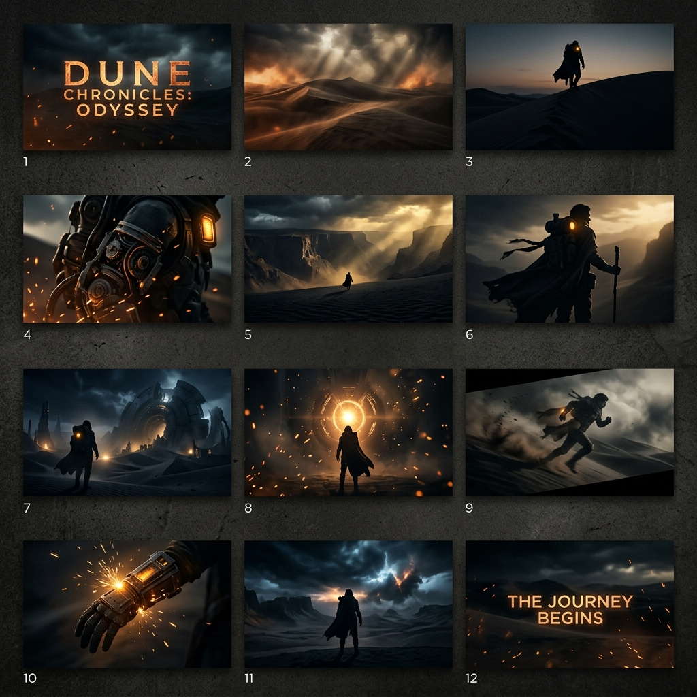
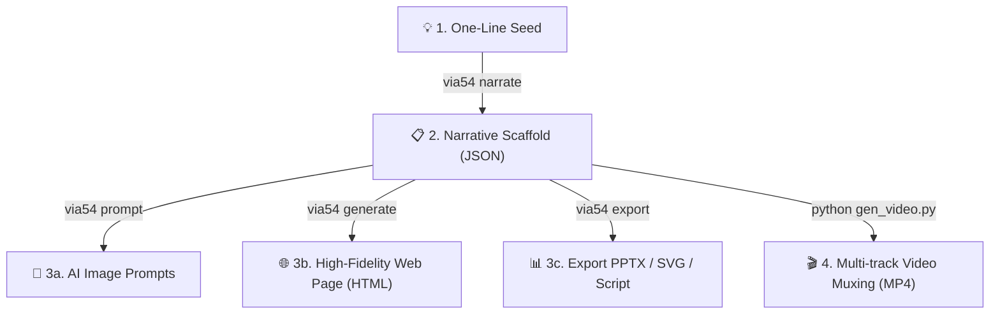
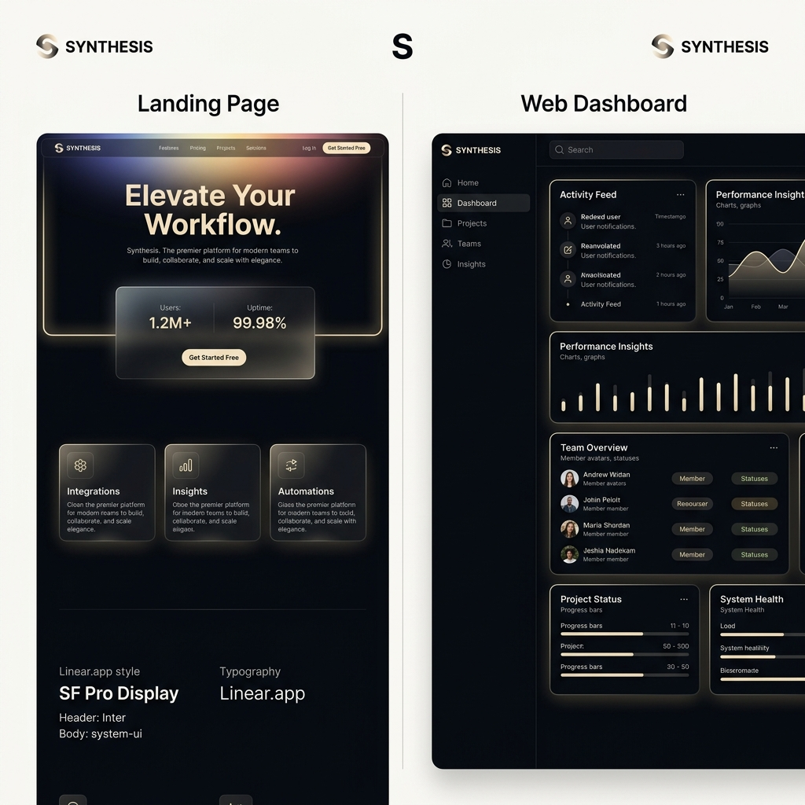
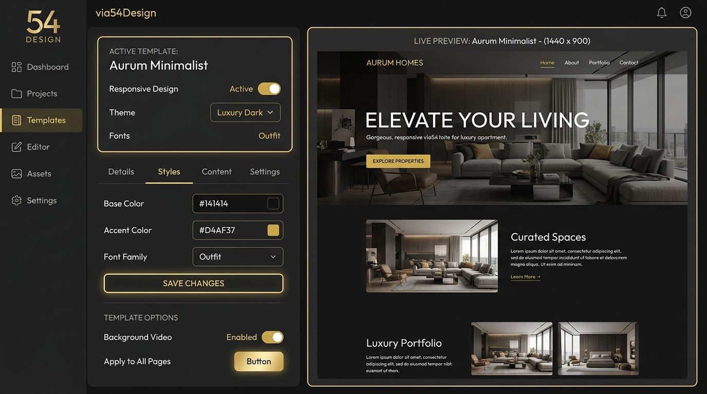

# via54Design

> **🌐 Language**: [🇨🇳 中文](./README.md) | [🇺🇸 English](#) (current)
>
> _This document is in English. For Chinese, click above._
> **Aesthetic Design Template Engine + Narrative Engine + Media Pipeline (Go)**

[](LICENSE)
[](go.mod)
[](templates/layouts/)
[](templates/color-schemes/)



---

## 🧠 Transform One-Line Inspiration into Cinematic Masterpieces

via54Design is not just a tool for aggregating skills or compiling code. It acts as an artistic partner that turns human inspiration into structured, high-aesthetic digital assets—videos, presentations (PPTX), and vector layouts.

---

### 🚀 v1.0 Complete Pipeline

via54Design provides a complete, end-to-end pipeline that transforms a simple seed sentence into final high-aesthetic visual layouts and media deliverables:



#### E2E Command Showcase:
1. **Step 1: Generate the Narrative Scaffold (JSON)**
   ```bash
   via54 narrate --seed "A lone mechanic searching for green source..." --model cinematic-epic --duration 90 --format json --output scaffold.json
   ```
2. **Step 2: Compile AI Image Prompts (26 control dimensions)**
   ```bash
   via54 prompt --from-scaffold scaffold.json --platform midjourney --output prompt.md
   ```
3. **Step 3: Compile High-Fidelity Web Presentation**
   ```bash
   via54 generate --from-narrative scaffold.json --layout landing-pricing --color cinematic-neon --font sans-geometric-tech --output index.html
   ```
4. **Step 4: Export Presentations and Vector Visuals**
   ```bash
   via54 export pptx scaffold.json --output story.pptx
   via54 export svg scaffold.json --output ./scenes
   ```
5. **Step 5: Run the Multi-track Muxing Pipeline for Video Rendering**
   ```bash
   python _scripts/gen_video.py --step all
   ```

---

### Part 1: Story → Cinematic Video Pipeline


#### From A Single Sentence to a 90-Second Cinematic Trailer

**Step 1 — Provide a seed sentence (your unique human spark)**
> "In a post-apocalyptic world swallowed by sandstorms, a lone mechanic searches for the last green source of life."

**Step 2 — Generate the Narrative Scaffold**
```bash
via54 narrate --seed "In a post-apocalyptic world..." \
  --model cinematic-epic --duration 90 --format json --output scaffold.json
```

The narrative engine maps your seed to the selected structure and outputs:
*   🎬 **12 storyboard shots** with camera work (e.g., *Dolly zoom, whip pan*), lighting (e.g., *volumetric sunbeams, Rembrandt*), and sound effects (e.g., *sub-bass boom*).
*   🎙️ **Voiceover scripts** and mood cues.
*   🖋️ **Fountain-format screenplay** outline.

**Step 3 — Narrative Models**

| Model | Narrative Arc | Best For |
|---|---|---|
| `three-act` | Question → Answer → Call to Action | Product launches, commercial ads |
| `heros-journey` | Ordinary → Adventure → Transformation → Return | Brand stories, documentaries |
| `cognitive-arc` | Hook → Core Concept → Case Study → Future | Educational explainers, tutorials |
| `problem-solution` | Pain Point → Solution → Proof → Action | Sales demos, landing page structure |
| `cinematic-epic` | Hook/Setup → Suspense Rising → Climax → Stinger | Film trailers, concept films, blockbusters |

---

### Part 2: Story → Multi-Layout Aesthetic Presentation

Render visual pages utilizing the generated narrative structure or manually compose layouts with color schemes.




```bash
via54 generate --layout landing-pricing --color cinematic-neon --font sans-geometric-tech \
  --title "The Last Oasis" --output index.html
```

*   **10 Responsive Layouts** ➜ Full high-fidelity HTML & CSS rendering for `landing-pricing`, `dashboard-3pane`, `blog-magazine`, `docs-sidebar`, `bento-grid-2x2`, and more.
*   **Golden Ratio Spacing System** ➜ Mathematical spacing and fluid typography that automatically adapts to TV, Desktop, Tablet, and Mobile screens.
*   **Cinematic Neon Color Scheme** ➜ A premium dark-ambient color scheme utilizing space black backdrop, translucent obsidian panels, golden amber glows, and electric violet accents.
*   **Google Vids Workflow Bridge** ➜ The Go-based PPTX exporter automatically writes narrative voiceover scripts into PowerPoint **Speaker Notes** XML. When you upload this PPTX to Google Drive and convert it into a Google Vids project, Google Vids extracts the speaker notes as the AI video voiceover script automatically!


---

### Part 3: CLI Commands

```bash
# General help
via54 --help

# List all registered layout/color/font templates
via54 list

# Interactively choose options
via54

# Direct generation
via54 generate --layout <layout-id> --color <color-id> --font <font-id>
```

## 🌐 Interactive Sandbox Web UI (Lovart-style Sandbox)

```bash
via54 web --port 8080
```

Start the interactive Web UI to access the E2E design sandbox:



**Key Features (Inspired by Lovart.ai / v0)**:
*   **Dual-Pane Workspace** ➜ Left panel for generation controls, right panel for interactive live previews.
*   **Device Simulator** ➜ Desktop, Tablet, and Mobile viewport emulation.
*   **WYSIWYG Inline Editor** ➜ Turn on text editing to click and modify text layers directly in the preview.
*   **Instant Theme Swapper** ➜ Switch color schemes dynamically (Gold, Blue, Ink Wash) with zero rendering lag.
*   **Clean Client-side Exporter** ➜ Filter development layers and export your customized designs instantly.

---

## 🖥️ Platform Compatibility

| OS | Architecture | Binary | Web UI | Export Features |
|---|---|---|:---:|:---:|
| **macOS** | amd64 / arm64 | `via54-darwin` | ✅ Native | Requires Node.js + ffmpeg |
| **Linux** | amd64 / arm64 | `via54-linux` | ✅ Native | Requires Node.js + ffmpeg |
| **Windows** | amd64 | `via54-windows.exe` | ✅ Native | Requires Node.js + ffmpeg |

---

## 🧪 Verification & Stability

via54Design comes with a unified master test suite:
```bash
python test_20_rounds.py
```
This single script verifies code compiler health, runs 20 integration test rounds, executes sequential longevity tests, and conducts multi-threaded API stress tests, ensuring 100% stable execution.

---

## License

Licensed under the [AGPL-3.0 License](LICENSE).
